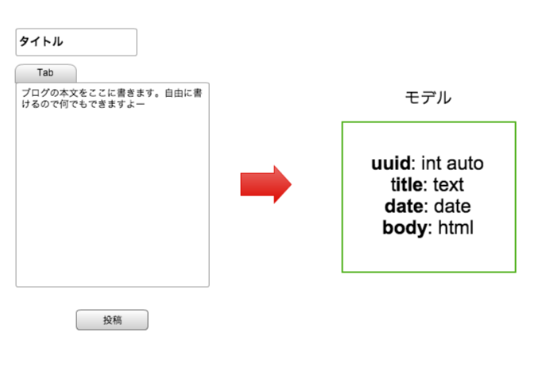
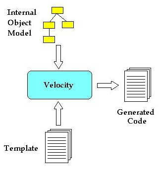
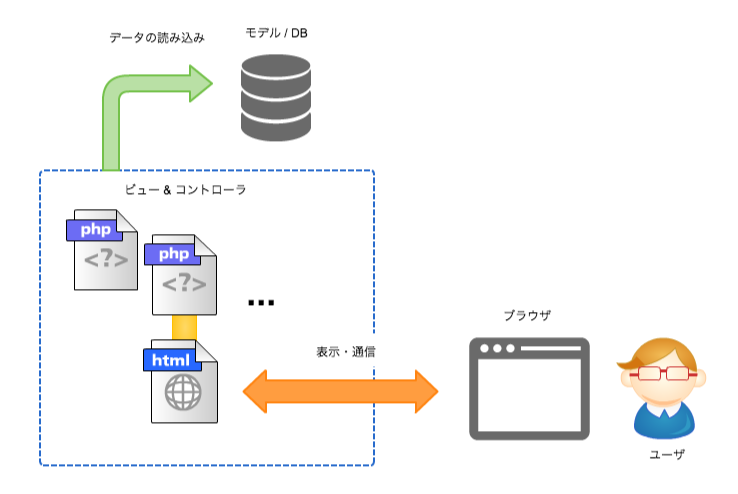

# Neo CMS (仮)

## 動機

- CMSの中には、Drupalのような**コンテンツ（モデル）を管理**できるものは少ない
- Webサービス設計の上で、最も難しいのがデータ（モデル）の構造
- **ビュー（テンプレート）**、**コントローラ（PHP等）**、**モデル（データ）**にはっきりと分離でき、あらゆるタイプのウェブサイトに対応するCMSを構築する

## モデルとは

- Drupalの**コンテンツ(タイプ)**と同じ概念。
- あるブログの記事をデータに変換すると、以下のようになる

`「記事番号（uuid）、タイトル（文字列）、投稿日、内容（HTML）」の配列`

- このような、ある記事やページに必要なデータの構造及びその内容を、**モデル**及び**データ**と定義する。

## ビューとは

- この図の ***"Internal Object Model"*** が、上記の**モデル**に当たる。
- この図の ***"Template"*** が、このCMSでいう**ビュー**に当たる。
- この図の ***"Velocity"*** に直接当たるものはないが、このように 「*データとビューを混合させ、成果物（HTML）を出力するもの*」 が、**コントローラ**になる。

実際にはコントローラは単純な**PHPコード**であり、ビューは**テンプレート（Smartyなど）**となる。

## 処理の流れ

- ビューとコントローラは、PHPやテンプレートとして、実際のファイルが置かれる
- ビューのファイル群は、実際に配置することもできるし、CMSの管理画面から作成・管理することもできる
- モデルは、CMSの設定画面から作成するが、実際にはデータベース（DB・SQL）に保存され、PHPから読み込まれる